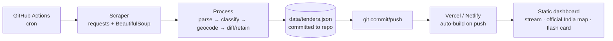

# Defence Tender Monitor — defproc.gov.in (Free Edition)

**Goal:** Monitor the MoD eProcurement portal (`defproc.gov.in`, NIC GePNIC) for new and updated tenders, tag them against a keyword taxonomy, plot them on the official map of India, and surface them on a live dashboard — at **₹0 recurring cost**, hosted on a free static host (Vercel / Netlify / GitHub Pages).

---

## 1. Scope

**In scope**
- Pull tender *listings* from defproc.gov.in (active, by-organisation, by-location, results/cancelled).
- Extract the fields the portal already publishes: tender ID, title, organisation chain, value, dates, status, buyer location, and the buyer's published address + PIN.
- Tag each tender against a relevance keyword taxonomy.
- Coarse geocode (pincode/city → lat-lng) for map plotting.
- Live dashboard: left-hand tender stream + official India map; both retain a tender for **72 hours** (3 days) then auto-clean; click a pin to flash the buyer's address card.
- Public, free-hosted **static** dashboard — anyone can view it, no login, no backend.
- **Archive / LPP Finder**: a searchable corpus of past + current bids (active + Tenders-in-Archive
  + Results/Award-of-Contract) for Last Purchase Price discovery, mapped to DPM 2025 forms
  (see `DPM_LPP_MAPPING.md`). Each result links to the defproc detail page and exports a
  DPMF 5 Ser 7 / DPMF 7 "Details of the Last Purchase" block.

**Out of scope — and forbidden (see CLAUDE.md)**
- ORBAT / order-of-battle or unit-hierarchy generation.
- "Dark unit" inference.
- Personnel name/rank extraction or LinkedIn correlation.
- Satellite / installation geolocation.
- Any source other than defproc.gov.in (no GeM, CPPP, paid aggregators).

This is a tender monitor that displays only what the tender itself publishes. It is not an intelligence-fusion tool.

---

## 2. Architecture



Everything runs in the free GitHub Actions runner on a schedule. It writes a data file back into the repo; the push triggers the static host to rebuild. The dashboard is fully client-side — no backend, no database to pay for.

---

## 3. Scraping methodology & philosophy

This is the load-bearing principle of the whole project: **we extract only from defproc's open, public endpoints, and we never build anything to defeat an access control.**

**Why this works.** GePNIC is a transparency portal — the tender listings are published *to be read publicly*, which is the entire point of public procurement. The listing pages are served as ordinary GET URLs under `/nicgep/app?page=...&service=page`, and the proof that they are open is that public search engines have them indexed (crawlers do not solve CAPTCHAs). Commercial aggregators openly mirror defproc for the same reason.

**Where the CAPTCHA actually sits.** On GePNIC the CAPTCHA guards the *interactive* flows — the keyword **Search** form, bidder **login**, and (in some configs) bid-**document download**. It does **not** guard the published listing data. So the crawler browses **by organisation / by location / by date**, which is CAPTCHA-free, and never touches the Search box, which is the thing that triggers the challenge.

**The rules (enforced in CLAUDE.md):**
- Crawl only public listing pages and the per-tender detail pages linked from them.
- **Do not** implement CAPTCHA solving, OCR-defeat, token replay, or paid solver integration against defproc. If any content requires solving a challenge or logging in, stop, log it, and degrade gracefully — never attempt to bypass.
- Be a polite crawler: a real descriptive User-Agent, ≥ 3 s between requests, a single worker, one pass per cron tick, honour `robots.txt`.
- Prefer an official feed/export if one exists — check for an RSS/Atom feed and for bulk data on data.gov.in (or via RTI) before relying on HTML scraping at all.

**Net result.** Listing-level monitoring (stream, map, tagging, retention) is entirely CAPTCHA-free and uses only public endpoints. The buyer-address enrichment behind the flash card is the only step that follows a detail page, and that is normally open too; the CAPTCHA is a fallback consideration, not a dependency the system is built to break.

---

## 4. Extraction detail

**Entry points** (`base = https://defproc.gov.in/nicgep/app`):
- `?page=FrontEndLatestActiveTenders&service=page` — primary new-tender feed
- `?page=FrontEndTendersByOrganisation&service=page` — browse by buyer
- `?page=FrontEndTendersByLocation&service=page` — browse by region
- archive / results / cancelled variants for status changes

**Listing parse.** Each page renders an HTML table: e-published date, bid-closing date, opening date, title + tender reference/ID, organisation chain. The scraper GETs the page, walks pagination, and parses the table into rows (`tender_id`, `title`, `org_chain`, dates, `location`, `detail_url`).
> Confirm the exact column order and pagination parameter against the live HTML during the build — do not hard-code assumptions.

**Extraction verification (required).** Parsing is not trusted until checked. Each parsed batch is
validated before it is written: every record must have a non-empty `tender_id`, `title`,
`org_chain` and a parseable closing date; `tender_id` must be unique; counts and a handful of
sample records are diffed against what the live listing page actually shows. A parser run that
yields zero records, or records failing the schema, fails loudly rather than committing junk. These
checks live in `tests/` and run both locally and in CI (see the testing policy).

**Archive & award data (for the LPP Finder).** Beyond the live listings, the scraper also walks
defproc's **Tenders-in-Archive** and **Results / Award-of-Contract (AoC)** pages — same public-GET
method, browsed by organisation/location/date. From the AoC pages it captures the **awarded value
and L1 bidder where defproc publishes them** (verified against the live site; where they are not
published, the record carries the buyer contact so the LPP can be obtained from the unit). These
feed the archive corpus, not the 72h live window.

**Detail enrichment (bounded step).** For each new tender, follow `detail_url` and parse the *Tender Inviting Authority / Address* block to fill `unit`, `buyer_address`, `pincode`. This is the only step that leaves the listing pages. If a detail page is gated, skip enrichment for that row and keep the listing-level record (graceful degradation).

---

## 5. Data model

One flat record per tender (every field is published by the portal):

```jsonc
{
  "tender_id": "2026_IN_DMMIS_44120_1",
  "title": "Supply of marine-grade portable diving compressors, 300-bar",
  "org_chain": "Ministry of Defence ▸ Indian Navy ▸ Western Naval Command",
  "value_inr": 4500000,                 // null if not listed
  "tender_type": "Open",
  "category": "Goods",
  "published_date": "2026-06-12",
  "closing_date": "2026-06-30",
  "status": "active",                   // active | closed | cancelled | retendered
  "location": "Mumbai",
  // --- buyer detail (detail-page enrichment; feeds the flash card) ---
  "unit": "Naval Dockyard (Mumbai)",
  "buyer_address": "Shahid Bhagat Singh Marg, Near Lion Gate, Mumbai",
  "pincode": "400023",
  // --- geocode (for map markers) ---
  "lat": 19.076,
  "lng": 72.877,
  // --- relevance + lifecycle ---
  "criticality": "critical",            // critical | routine   (from scraper/classify.py)
  "confidence": 1.0,                    // 0–1
  "domains": ["STRIKE"],                // matched system domains, may be []
  "named_system": "BrahMos",            // matched named Indian system, or null
  "first_seen": "2026-06-12T06:00:00Z", // ISO 8601
  "last_seen":  "2026-06-14T06:00:00Z",
  "detail_url": "https://defproc.gov.in/nicgep/app?page=FrontEndTenderDetails&..."
}
```

`first_seen` / `last_seen` drive change detection and the 72-hour retention. `unit` / `buyer_address` / `pincode` / `lat` / `lng` are what the dashboard's map markers and flash card read.

---

## Classification — CRITICAL / ROUTINE (`scraper/classify.py`)

Every tender is labelled **CRITICAL** or **ROUTINE** by a self-contained, **stdlib-only** keyword classifier (`ProcurementClassifier`). No external dependency, no paid API — it fits the free constraint exactly.

**Logic.** A tender is **CRITICAL** when the *item being procured* matches a future-warfare / intelligence system — either a **named Indian system** (BrahMos, Akash, Samyukta, Rustom, Varunastra, …) or a **domain keyword** across 17 domains: UAS, USV, UUV, UGV, C-UAS, AIR_DEFENCE, DEW, EW_SIGINT, STRIKE, SPACE, SSA_SDA, AI_ML, CYBER, QUANTUM, COGNITIVE_IO, ENABLERS, INTELLIGENCE_EQUIPMENT. Everything else is **ROUTINE** (the default).

**Key principle — item, not owner.** Unit/organisation names are captured as *metadata only* and **never** change the verdict. A cleaning, ration, AC-maintenance or whitewashing contract is ROUTINE even when the buyer is DRDO or a naval command. This deliberately keeps the system on *item relevance*, not unit-targeting — in line with the project scope.

**Interface.** `ProcurementClassifier().classify(text)` returns `ClassificationResult(classification, confidence, matched_keywords, domains, named_system_match, unit_org_matches)`. The pipeline maps this onto the record as `criticality` / `confidence` / `domains` / `named_system`. Classify on `title` (always available from the listing) and re-run on `title + " " + description` once the detail page is enriched, if the description adds signal.

**Role.** Criticality is the primary signal: CRITICAL tenders are highlighted (amber, pulsing) and ordered first on the dashboard,. ROUTINE tenders are still shown and plotted, just muted.

## 6. Processing

1. **Parse** listing HTML → rows.
2. **Enrich** new rows via the bounded detail-page step → buyer block.
3. **Classify** with `scraper/classify.py` (`ProcurementClassifier`) on `title` (+ `description` when enriched) → `criticality` / `confidence` / `domains` / `named_system`. Unit/org names are captured as metadata only and **do not** affect the verdict — a cleaning contract for a defence lab is still ROUTINE.
4. **Geocode** pincode/city → `lat`/`lng` from the offline India Post CSV.
5. **Diff** against the previous `tenders.json`: mark new IDs, refresh `last_seen`, flag status changes.
6. **Retain / clean**: keep records whose `first_seen` is within the retention window; drop older.

---

## 7. Storage & retention

**Where tenders are stored — and why.** There is no database. Each pipeline run writes a single
JSON file, `data/tenders.json`, and commits it to the repo. The static host serves that file as-is
and the dashboard fetches it client-side. JSON-in-repo is chosen deliberately: it is free (no DB to
host), versioned (every scrape is a git commit, so history and diffs are auditable), portable, and
directly readable by a static page with zero backend. If volume ever outgrows a committed file, the
documented upgrade is the Supabase free tier — still free, no architecture change for the dashboard.

**Retention**

- **Live view = 72 hours.** The dashboard filters to `now − first_seen < 72h` on load, and the stream + map drain and auto-clean a tender exactly at 72 h.
- **Served file** `data/tenders.json` holds the live window plus a small buffer (e.g. 5 days) so brief gaps don't drop edge cases.
- **Archive store (LPP Finder).** Past + current bids are kept in `data/archive/` and, at scrape
time, the Action precomputes a compact **MiniSearch index** (`data/lpp-index.json`) plus a lean
records file. The browser loads that prebuilt index and searches entirely client-side — no server,
no database. This is sized for a **mid-size archive (~15k bids), pure free-static**; beyond that the
documented upgrade is the Supabase free tier (server-side full-text search), with no change to the
live dashboard. The 72h live view and the archive are separate datasets.

---

## 8. Dashboard (already built — `web/defproc-tender-watch.html`)

Self-contained, no dependencies, no map tiles. Two views via a header toggle — **Live Monitor** and **LPP Finder** (archive search):
- **Left:** live tender stream — critical-first ordering, a CRITICAL/ROUTINE badge with matched domains, a life-bar that drains over 72 h, "Nh left" countdown.
- **Right:** **official map of India** drawn from an embedded boundary GeoJSON that includes PoK, Gilgit-Baltistan, Aksai Chin (J&K/Ladakh) and Arunachal Pradesh as one landmass. **No tile basemap** is used, so no de-facto border can leak in — the only safe way to stay compliant. Markers plot at each buyer's coordinates and pulse; click one to **flash a card** showing the classifier verdict (criticality · confidence · domains · named system) and the buyer block — unit → address → PIN — straight from the tender.
- **Retention:** stream and map clean in lock-step at 72 h.
- **Detail link:** the flash card carries an "open on defproc ↗" link (`detail_url`) to the actual tender page; tender PDFs are not auto-fetched (gated flow) — the link takes the user there.
- **Wiring:** set `CONFIG.DATA_URL = "./tenders.json"` for the live view; point the LPP Finder at the prebuilt `data/lpp-index.json` + records. The live view reads `unit` / `buyer_address` / `pincode` / `lat` / `lng`; the LPP view reads the §5.35.1 fields + `detail_url`.

> **Sovereign boundary — verified.** The embedded boundary is the **`datameet/maps` Country** file — "the land area of India including disputed territories in accordance with the official boundary of India as per the Survey of India" (Aksai Chin, PoK, Gilgit-Baltistan, Shaksgam compiled in). It is simplified to ~119 KB and shipped as `web/india-official.geojson`. Coverage is confirmed by an automated **point-in-polygon test** (`tests/test_boundary.py`): Aksai Chin, Gilgit-Baltistan, PoK, Siachen, Shaksgam, **Tawang** and the full Arunachal salient all fall **inside** the landmass; this test must pass in CI. No tile basemap is ever used.

---

## Archive & LPP Finder (DPM 2025)

A second dashboard view searches the historical corpus for **Last Purchase Price** discovery.
Search an item/service → ranked past + current bids, each showing the DPM §5.35.1 costs-&-prices
fields (item, buyer unit, mode of tendering, date/FY, quantity, **awarded value where published**),
the §5.33.4 vintage caveat (auto-flagged when LPP > 3 FY old), a link to the defproc page, and a
**copy-ready export** that fills DPMF 5 Ser 7 ("Details of the Last Purchase"), Ser 6(a) (LPP) and
DPMF 7 (per-unit LPP basis), with escalation/ERV placeholders the indenter completes per
§5.32.2(c)/(d)/(i). The full, source-verified mapping is in **`DPM_LPP_MAPPING.md`**. The export is
a drafting aid (forms are indicative per DPMF 5 Note b); the indenter/IFA completes and vets it.

## 9. Hosting & access

The dashboard is a **static** site (the HTML plus `data/tenders.json`). Connect the repo to **Vercel / Netlify / GitHub Pages**; every commit the Action makes redeploys it automatically. Anyone can open the public URL and view it — no login, no backend, no API keys, and the live site makes no outbound calls. The **only** component that reaches `defproc.gov.in` is the scraper, which runs inside GitHub Actions (open internet by default) — never the viewer's browser and never the deployed site.

---

## 10. Repo structure

```
defproc-monitor/
├── .github/workflows/scrape.yml     # cron → scrape → commit data
├── scraper/
│   ├── fetch.py                     # GET listing pages, paginate (public endpoints only)
│   ├── parse.py                     # BeautifulSoup → rows
│   ├── enrich.py                    # follow detail_url → unit/address/pincode (bounded, degrades)
│   ├── archive.py                   # scrape Tenders-in-Archive + Results/AoC → archive corpus
│   ├── index_lpp.py                 # build data/lpp-index.json (MiniSearch) + records
│   ├── classify.py                  # ProcurementClassifier → criticality (stdlib only)
│   ├── geocode.py                   # pincode/city → lat/lng (offline CSV)
│   ├── diff.py                      # new/updated/closed + 72h retention
├── data/
│   ├── tenders.json                 # live view (72h + buffer)
│   ├── lpp-index.json               # prebuilt MiniSearch index for the LPP Finder
│   ├── pincodes.csv                 # offline India Post directory
│   └── archive/                     # historical corpus (jsonl, ~15k bids)
├── web/
│   ├── defproc-tender-watch.html    # the dashboard (already built)
│   └── india-official.geojson       # production boundary (self-hosted, vetted)
├── DPM_LPP_MAPPING.md                # verified DPM 2025 → LPP field mapping
├── requirements.txt                 # requests, beautifulsoup4  (classify.py is stdlib-only)
└── README.md
```

---

## 11. Cost

| Item | Cost |
|---|---|
| GitHub repo + Actions (cron compute) | ₹0 |
| Storage (JSON in repo) | ₹0 |
| Geocoding (offline CSV) | ₹0 |
| Static host (Vercel / Netlify / Pages) | ₹0 |
| **Total recurring** | **₹0** |

Upgrade path if the served file outgrows the repo: **Supabase free tier** (500 MB Postgres + REST). Still free.

---

## 12. Build order

1. `fetch.py` + `parse.py` against `FrontEndLatestActiveTenders`, validated on live HTML → sample `tenders.json`.
2. `enrich.py` (bounded detail step) → buyer block.
3. `classify.py` (already supplied — drop into `scraper/`, wire `classify(title)` ); `geocode.py` + offline pincode CSV.
4. `diff.py` (change detection + 72h retention).
5. `.github/workflows/scrape.yml` on a daily/twice-daily cron.
6. `archive.py` (Tenders-in-Archive + Results/AoC) + `index_lpp.py` (build `lpp-index.json`).
7. Wire the dashboard: live view `CONFIG.DATA_URL = "./tenders.json"`; LPP Finder → `lpp-index.json`; deploy `web/` to Vercel.
8. Confirm `india-official.geojson` is in place and `tests/test_boundary.py` is green.

---

## Testing & verification policy

**Every phase is build → test → verify before moving on.** No page, section, or pipeline stage is
considered done until a test proves it does what it was meant to do. Tests live in `tests/` and run
both locally and in CI (a GitHub Actions check), so a regression blocks the commit rather than
reaching the dashboard.

Per-phase verification (the bar each must clear):

| Phase | Verified by |
|---|---|
| fetch + parse | Real records pulled from the live listing; schema + uniqueness checks pass; sample diffed against the page |
| enrich | Buyer block (`unit`/`buyer_address`/`pincode`) filled from detail pages; gated pages degrade without crashing |
| classify | `classify.py` self-test passes **and** a fixture of known tenders classifies correctly (UAV/EW/missile → CRITICAL; housekeeping/ration → ROUTINE) |
| geocode | Known pincodes/cities resolve to expected lat/lng within tolerance |
| diff + retain | New IDs detected, no duplicates, records expire at exactly 72 h |
| map / boundary | `tests/test_boundary.py` point-in-polygon passes for Aksai Chin, Gilgit-Baltistan, PoK, Siachen, Shaksgam, Tawang, full Arunachal |
| archive + index | Tenders-in-Archive + Results/AoC scraped; awarded value captured where published; `data/lpp-index.json` builds and loads |
| LPP Finder | Item search returns expected bids; vintage caveat flags LPP > 3 FY; export produces a valid DPMF 5 Ser 7 / DPMF 7 block; defproc link resolves |
| dashboard | Both views render; live view: stream + map, CRITICAL highlighted, flash card + defproc link, retention drains both; LPP view: search + results + export |

**Final end-to-end phase.** Once all phases are individually green, run **one full E2E pass**: live
scrape → enrich → classify → geocode → diff/retain → write `data/tenders.json` → load it in the
dashboard and confirm real tenders appear on the stream and the map with correct criticality, the
sovereign boundary renders, and the retention window behaves. Only after this E2E pass is the build
declared done.

## 13. Limits (clear-eyed)

- Listing-level data is fully open; the buyer address sits on the detail page and is normally reachable, but may occasionally be gated — in which case that one field degrades and the rest flows.
- Portal HTML changes will break parsers periodically; keep parse logic isolated in `parse.py` so fixes are quick.
- The boundary is the datameet Survey-of-India-aligned official sovereign file (simplified), verified by point-in-polygon test. For maximum fidelity the full-resolution `datameet/maps` Country file can be dropped in unchanged — the renderer handles it.
- One source only. Resist scope creep until the single-source monitor is solid.
